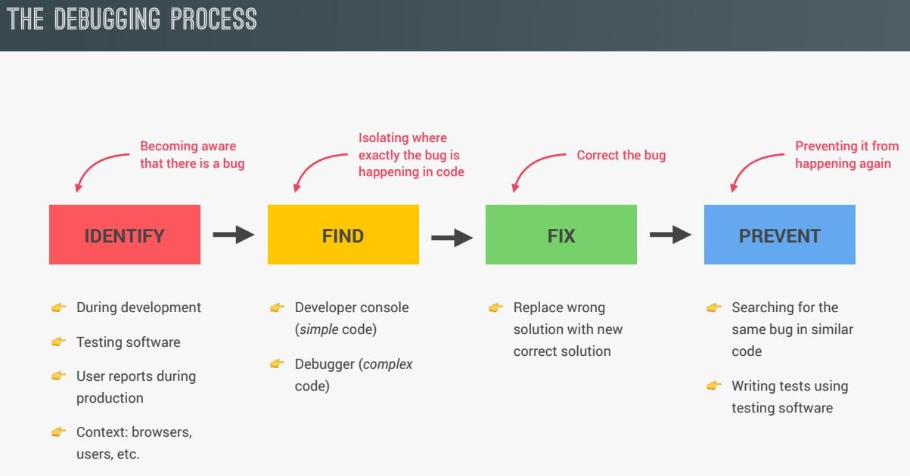

# Developer Skills & Editor Setup

## Setting up Prettier and VS Code

- Install and Enable Prettier - Code formatter
- Go to Settings &rarr; Search for `default formatter` &rarr; Choose `esbenp.prettier-vscode`.
- Go to Settings &rarr; Search for `format on save` &rarr; Tick the Box.

> Prettier Configuration [Docs](https://prettier.io/docs/en/options)

### Use Single Quotes instead of Double Quotes

- create a configuration file `.prettierrc`.
- write the code:

        {
        "singleQuote": true
        }

## Write User Snippets

- Go to Command Palette &rarr; Search `user snippet` and click on `Configure User Snippet` &rarr; Click on `New Global Snippets file...` &rarr; type a file name and hit ENTER.

### Creating shortcut for `console.log()`

- type `cl` and hit ENTER.

        "Print to console": {
                "scope": "javascript,typescript",
                "prefix": "cl",
                "body": [
                        "console.log($1);",
                        "$2"
                ],
                "description": "Log output to console"
        }

## Jonas's Installed VS Code Extensions

- [Auto Rename Tag](https://marketplace.visualstudio.com/items?itemName=formulahendry.auto-rename-tag)
- [Auto Close Tag](https://marketplace.visualstudio.com/items?itemName=formulahendry.auto-close-tag)
- [ESLint](https://marketplace.visualstudio.com/items?itemName=dbaeumer.vscode-eslint)
- [Image preview](https://marketplace.visualstudio.com/items?itemName=kisstkondoros.vscode-gutter-preview)
- [Monokai Pro](https://marketplace.visualstudio.com/items?itemName=monokai.theme-monokai-pro-vscode)
- [Prettier - Code formatter](https://marketplace.visualstudio.com/items?itemName=esbenp.prettier-vscode)
- [TODO Highlight](https://marketplace.visualstudio.com/items?itemName=wayou.vscode-todo-highlight)

# Installing Node.js and Setting Up a Dev Environment

## Easy Way: using VS CODE extension

- [Live Server](https://marketplace.visualstudio.com/items?itemName=ritwickdey.LiveServer)

## Install Node.js and use an npm package called Live Server

- [Download](https://nodejs.org/en) and Install `Node.js`
- Open VS CODE TERMINAL
- Check if Node.js is installed: `$ node -v`
- To install npm live-server: `$ npm install live-server -g`
- run live-server: `$ live-server` and hit ENTER

# Learning How to Code

> Follow this [PDF](./Learning-How-to-Code.pdf).

# How to Think Like a Developer: Become a Problem Solver!

> Follow this [PDF](./How-to-Think-Like-a-Developer.pdf).

# Debugging with the Console and Breakpoints

## Other ways of finding bug in Console

        console.table();
        console.warn();
        console.error();

## How to use Debugger?

- **WAY-1:** add `debugger;` on code from where we want to analyze our code. Code execution will automatically pause there.

- **WAY-2:** open source tab &rarr; add breakpoints on code by clicking on code line number &rarr; reload the page.
